<p align="center">
  
</p>

<p align="center">
  <a href="https://github.com/ishandutta2007/Awesome-Awesome-Awesome"></a>
  <a href="https://discord.gg/jc4xtF58Ve"></a>
  <a href="https://github.com/ishandutta2007/Awesome-Hallucination-Detection/stargazers"></a>
  <a href="https://github.com/ishandutta2007/Awesome-Hallucination-Detection/network/members"></a>
  <a href="https://github.com/ishandutta2007/Awesome-Hallucination-Detection/blob/main/LICENSE"></a>
  <a href="https://github.com/ishandutta2007/Awesome-Hallucination-Detection/pulls"></a>
  <a href="https://github.com/ishandutta2007"></a>
</p>

---

# 🧠 Awesome Hallucination Detection & LLM Reliability

> **A curated ecosystem of SaaS platforms, open-source frameworks, benchmarks, evaluators, and guardrails for detecting LLM hallucinations, ensuring RAG groundedness, verifying factual claims, and measuring response faithfulness.**

*Last updated: August 2026* • *Curated for AI Engineers, RAG Developers, ML Researchers & AI Governance Teams*

---

## 📑 Table of Contents

- [🔍 Overview & Taxonomy](#-overview--taxonomy)
- [🏢 SaaS & Hosted Platforms](#-saas--hosted-platforms)
- [💻 Open-Source GitHub Projects](#-open-source-github-projects)
- [🧱 Open-Source Building Blocks Architecture](#-open-source-building-blocks-architecture)
- [📊 Key Concepts: Groundedness vs. Faithfulness vs. Factuality](#-key-concepts-groundedness-vs-faithfulness-vs-factuality)
- [❓ Frequently Asked Questions (FAQ)](#-frequently-asked-questions-faq)
- [🤝 How to Contribute](#-how-to-contribute)
- [📈 Star History](#-star-history)
- [⚖️ Disclaimer](#-disclaimer)

---

## 🔍 Overview & Taxonomy

Large Language Models (LLMs) and Retrieval-Augmented Generation (RAG) pipelines frequently produce outputs that contradict source knowledge, contain unsupported assertions, or state falsehoods as fact. This curated list categorizes tools designed to identify, quantify, monitor, and prevent these failures.

```
Hallucination Detection Ecosystem
├── 🏢 Enterprise SaaS & Hosted Platforms (Tracing, Continuous Evals, Production Guardrails)
├── 🔬 Specialized Grounding & Factuality Models (MiniCheck, Lynx, HHEM, FActScore)
├── 🧪 Offline RAG & LLM Evaluation Frameworks (Ragas, DeepEval, OpenAI Evals, Inspect AI)
├── 🔭 AI Observability & Tracing Stacks (Langfuse, Phoenix, Opik, TruLens, OpenLLMetry)
├── 🛡️ Real-Time Output Guardrails & Safety (NeMo Guardrails, Guardrails AI, LLM Guard, Purple Llama)
└── 📈 Standardized Factuality & Truth Benchmarks (TruthfulQA, HaluEval, RAGTruth, HELM)
```

---

## 🏢 SaaS & Hosted Platforms

> 🌐 **Market Overview**: The global AI Observability, LLM Evaluation, and Hallucination Detection market is estimated at **$1.8B–$2.5B in 2026** and projected to exceed **$12B+ by 2030** (growing at a ~34% CAGR). The sector is currently **moderately to highly fragmented** with specialized niche startups (evaluators, guardrails, tracer engines) rapidly converging toward unified platforms alongside major cloud/data infrastructure consolidators (e.g., Snowflake, NVIDIA, ClickHouse, Coralogix).

The table below lists top commercial platforms, sorted in **descending order by company scale (Valuation / Market Cap / Revenue)**:

| Platform / Product | Description & Hallucination Focus | Valuation / Revenue / Scale | Starting Pricing | Free Tier / Trial Limits |
| :--- | :--- | :--- | :--- | :--- |
| **[NVIDIA NeMo](https://developer.nvidia.com/nemo)** 🟢 | Generative-AI development and guardrails ecosystem to constrain, evaluate, and monitor LLM outputs for hallucinations. | **~$4.92T Market Cap** / $215.9B Rev (NASDAQ: NVDA) | $1.00 / GPU hour (pay-as-you-go) or $4,500.00 / GPU / year (NVIDIA AI Enterprise) | 90-day free trial of NVIDIA AI Enterprise; core NeMo open-source framework is 100% free |
| **[Truera](https://truera.com/)** ❄️ | AI quality and explainability platform (acquired by Snowflake) powering the open-source TruLens RAG Triad groundedness evaluator. | **~$114B Market Cap** / $4.68B Rev (NYSE: SNOW) | $0.00 (TruLens open-source; Snowflake AI Observability billed at standard compute rates) | 100% free open-source TruLens library + 30-day Snowflake trial with $400 free credits for managed Cortex AI Observability |
| **[Langfuse Cloud](https://langfuse.com/)** ⚡ | Hosted LLM engineering and observability platform supporting trace scoring, custom evaluators, and hallucination metrics (acquired by ClickHouse). | **~$15B Parent Valuation** ($4.5M raised prior to acquisition) | $29.00 / month (Core plan with 100,000 units/month, 90-day retention, unlimited users; $8/100k units overage) | Free Hobby plan with 50,000 units/month, 2 users, and 30-day data retention (Self-hosted is 100% free) |
| **[Aporia](https://www.aporia.com/)** 🛡️ | AI observability and guardrails platform offering real-time monitoring and mitigation for LLM hallucinations (acquired by Coralogix). | **~$1.5B Parent Valuation** ($30M raised prior to acquisition) | $99.00 / month (Starter plan via Coralogix) | 14-day free trial (no credit card required) + Free Community tier for prototype projects |
| **[LangSmith](https://www.langchain.com/langsmith)** 🦜 | LLM engineering and observability platform with tracing, datasets, automated evaluators, and production hallucination monitoring. | **~$1.3B Valuation** / ~$16M ARR ($35M raised) | $39.00 / seat / month (Plus tier; $0.50 / 1,000 traces overage) | Free Developer plan with 1 user seat, 5,000 traces/month, and 14-day data retention |
| **[Weights & Biases Weave](https://wandb.ai/site/weave/)** 🐝 | LLM evaluation and observability toolkit providing execution tracing, dataset benchmarking, and custom hallucination scoring. | **~$1.25B Valuation** / ~$13.6M ARR ($250M raised) | $50.00 / user / month (W&B Models/Weave Teams plan; additional ingestion at $0.10/MB) | Free Forever personal/academic plan with 1 user seat, 100 GB storage, and full access to Weave traces/evals |
| **[Braintrust](https://www.braintrust.dev/)** 🧠 | AI evaluation and observability platform supporting automated evaluations, scoring, datasets, and live production tracing. | **~$800M Valuation** ($36M+ raised) | $249.00 / month (Pro plan with 5 GB/month data, 50k scores/month, 30-day retention, unlimited seats) | Free Starter plan ($0/month, no credit card required) with 1 GB data/month, 10,000 scores/month, unlimited users, and 14-day retention |
| **[Arize AI](https://arize.com/)** 🔭 | AI observability and evaluation platform with Phoenix integration for LLM tracing, RAG quality, and faithfulness analysis. | **~$500M Est. Valuation** / ~$45M ARR ($61M raised) | $50.00 / month (AX Pro plan; $0.001 / span overage) | Free plan (AX Free) with 25,000 trace spans/month, 1 GB storage, 15-day retention, and unlimited seats/evals |
| **[Cleanlab](https://cleanlab.ai/)** 🧼 | AI quality platform and Trustworthy Language Model (TLM) API for detecting unreliable outputs and scoring RAG trustworthiness. | **~$150M–$300M Est. Valuation** / ~$8.1M ARR ($30M raised) | $0.001 / evaluation (TLM Lite / pay-per-token API tier) | Free tier with up to 5,000 data points in Cleanlab Studio + free initial TLM API credits |
| **[Galileo AI](https://galileo.ai/)** 🔭 | LLM evaluation and observability platform providing quality/safety evaluation, RAG metrics, and hallucination scoring. | **~$100M–$200M Est. Valuation** / ~$19.4M ARR ($63M raised) | $100.00 / month (Pro plan; $0.002 / trace overage) | Free plan with 5,000 traces/month and access to core evaluation metrics |
| **[Vectara](https://www.vectara.com/)** 🎯 | Grounded-generation and RAG platform with built-in Hallucination Evaluation Model (HHEM) to score answer-context grounding. | **~$150M Est. Valuation** ($74M raised) | $100,000.00 / year (~$8,333.33/month for production SaaS tier) | 30-day free trial with 10,000 platform credits, agent creation, retrieval workflows, and HHEM evaluation |
| **[Comet Opik](https://www.comet.com/docs/opik/)** ☄️ | LLM observability and evaluation platform for tracing, testing, and evaluating RAG pipelines and agent hallucination rates. | **~$100M–$150M Est. Valuation** ($68M raised) | $19.00 / month (Pro plan with up to 50 team members and 100,000 spans/month) | Free Cloud plan with up to 10 team members, 25,000 spans/month, and 60-day data retention (Self-hosted is 100% free) |
| **[Fiddler AI](https://www.fiddler.ai/)** 🎻 | AI observability and evaluation platform with real-time guardrails for hallucination, faithfulness, and safety scoring. | **~$100M Est. Valuation** / ~$9.3M ARR ($47M raised) | $0.002 / trace (Developer plan) | Free Forever plan for Fiddler Guardrails (real-time safety scoring, faithfulness, prompt injection & PII detection) |
| **[Patronus AI](https://www.patronus.ai/)** 🛡️ | AI evaluation and reliability platform with specialized hallucination evaluators (Lynx) to verify if responses are grounded in context. | **~$50M–$90M Est. Valuation** / ~$3.1M ARR ($20M raised) | $10.00 / 1,000 API calls (Pay-as-you-go API) | $5.00 free API credits upon signup + 45-minute evaluation strategy session |
| **[Patronus Lynx](https://www.patronus.ai/lynx)** 🐾 | Specialized hallucination detection model family (8B & 70B) for verifying response groundedness against reference documents. | **Part of Patronus AI** ($20M raised) | $0.00 for open-source model weights (or $10.00 / 1,000 calls via Patronus RemoteEvaluator API) | 100% free open weights (CC-BY-NC-4.0) for local/Ollama inference + $5.00 free API credits on Patronus Cloud |
| **[WhyLabs](https://whylabs.ai/)** 📊 | AI observability and monitoring platform for detecting data, model, and LLM quality/groundedness failures in production. | **~$50M–$80M Est. Valuation** ($36M raised; transitioned to open-source) | $0.00 (Fully transitioned to 100% open-source via `whylogs` & `langkit`) | 100% free open-source with unlimited predictions, models, and traces |
| **[Humanloop](https://humanloop.com/)** 🔁 | Prompt engineering, evaluation, and observability platform supporting automated feedback and production hallucination tracking. | **~$30M–$50M Est. Valuation** ($7.9M raised; team acqui-hired by Anthropic) | $400.00 / month (Team plan) | 14-day free trial with 2 team members, 50 evaluation runs, and 10,000 logs/month |
| **[Confident AI](https://www.confident-ai.com/)** 🚀 | Hosted continuous evaluation and monitoring platform built around DeepEval for hallucination and faithfulness testing. | **~$20M–$30M Est. Valuation** ($2.7M Seed raised) | $200.00 / month (Starter plan with unlimited seats, 5 projects, 5 GB-month traces; $1/GB-month overage) | Free tier ($0/month) with 2 seats, 1 project, 5 test runs/week, 1 GB-month trace spans (~100k traces), and 1-week retention |

---

## 💻 Open-Source GitHub Projects

Below is a curated collection of top open-source frameworks, hallucination detectors, RAG evaluation libraries, guardrails, and benchmarks, **sorted in descending order by GitHub Star count**:

1. **[LangChain](https://github.com/langchain-ai/langchain)** [](https://github.com/langchain-ai/langchain/stargazers) 🦜  
   *The industry-standard framework for context-augmented LLM applications with extensive integrations for automated evaluation, retrieval validation, tracing, and feedback loops.*

2. **[LlamaIndex](https://github.com/run-llama/llama_index)** [](https://github.com/run-llama/llama_index/stargazers) 🦙  
   *Leading context-engineering framework for LLM and RAG pipelines with built-in evaluation modules that verify response faithfulness, pairwise comparisons, and retrieval precision.*

3. **[DSPy](https://github.com/stanfordnlp/dspy)** [](https://github.com/stanfordnlp/dspy/stargazers) 🧩  
   *Stanford's framework for algorithmically programming and optimizing LLM pipelines. Combines automated prompt compilation with custom factuality and faithfulness metrics to optimize against hallucinations.*

4. **[Langfuse](https://github.com/langfuse/langfuse)** [](https://github.com/langfuse/langfuse/stargazers) ⚡  
   *Open-source LLM engineering and observability platform with OpenTelemetry tracing, LLM-as-a-judge evaluators, prompt management, dataset curation, and custom hallucination scoring.*

5. **[Haystack](https://github.com/deepset-ai/haystack)** [](https://github.com/deepset-ai/haystack/stargazers) 🌾  
   *End-to-end framework by deepset for building production RAG, multimodal pipelines, and semantic search systems with evaluation components measuring groundedness and answer correctness.*

6. **[Opik](https://github.com/comet-ml/opik)** [](https://github.com/comet-ml/opik/stargazers) ☄️  
   *Modern, open-source LLM evaluation and observability platform by Comet for tracing execution graphs, testing prompt variations, scoring hallucination rates, and benchmarking agent workflows.*

7. **[OpenAI Evals](https://github.com/openai/evals)** [](https://github.com/openai/evals/stargazers) 🧪  
   *OpenAI's official evaluation framework for testing LLM systems against configurable benchmarks, model-graded criteria, and custom factuality evaluation datasets.*

8. **[DeepEval](https://github.com/confident-ai/deepeval)** [](https://github.com/confident-ai/deepeval/stargazers) 🎯  
   *Pytest-like unit testing framework for LLMs with battle-tested metrics for Hallucination, Faithfulness, Contextual Relevancy, Contextual Recall, and Answer Correctness.*

9. **[Ragas](https://github.com/explodinggradients/ragas)** [](https://github.com/explodinggradients/ragas/stargazers) 📊  
   *Pioneering evaluation framework tailored for RAG pipelines. Offers foundational metrics: Faithfulness (measuring factual grounding against retrieved documents), Answer Relevance, and Context Precision.*

10. **[lm-evaluation-harness](https://github.com/EleutherAI/lm-evaluation-harness)** [](https://github.com/EleutherAI/lm-evaluation-harness/stargazers) 🏇  
    *EleutherAI's standard evaluation harness for zero-shot and few-shot language model benchmarking across hundreds of standardized tasks and truthfulness benchmarks.*

11. **[Cleanlab](https://github.com/cleanlab/cleanlab)** [](https://github.com/cleanlab/cleanlab/stargazers) 🧼  
    *Data-centric AI package to identify label issues, detect ungrounded model outputs, estimate epistemic uncertainty, and benchmark hallucination detection in LLMs.*

12. **[Arize Phoenix](https://github.com/Arize-ai/phoenix)** [](https://github.com/Arize-ai/phoenix/stargazers) 🔥  
    *AI observability library providing tracing, RAG visualization, embeddings drift analysis, and evaluation benchmarks for diagnosing hallucination hotspots.*

13. **[OpenLLMetry](https://github.com/traceloop/openllmetry)** [](https://github.com/traceloop/openllmetry/stargazers) 📡  
    *OpenTelemetry-based telemetry collection for LLM applications. Captures traces across LangChain, LlamaIndex, LiteLLM, and raw API calls to trace hallucination triggers.*

14. **[Guardrails AI](https://github.com/guardrails-ai/guardrails)** [](https://github.com/guardrails-ai/guardrails/stargazers) 🛡️  
    *Framework for enforcing structural, safety, and factuality constraints on LLM outputs via programmable validators (e.g., verifying context support and regex correctness).*

15. **[NVIDIA NeMo Guardrails](https://github.com/NVIDIA-NeMo/Guardrails)** [](https://github.com/NVIDIA-NeMo/Guardrails/stargazers) 🟢  
    *Toolkit for adding programmable rails to LLM dialogues using Colang, covering topical guardrails, factuality checking against retrieved evidence, and safety filtering.*

16. **[Purple Llama](https://github.com/meta-llama/PurpleLlama)** [](https://github.com/meta-llama/PurpleLlama/stargazers) 🦙  
    *Meta's comprehensive umbrella project for open trust and safety tools, containing Llama Guard, CyberSec Eval, and factuality guardrail checkpoints.*

17. **[Deepchecks LLM Evaluation](https://github.com/deepchecks/deepchecks)** [](https://github.com/deepchecks/deepchecks/stargazers) ✅  
    *Testing and validation suite providing automated CI/CD checks for LLMs, evaluating model degradation, factual drift, and unexpected hallucinations.*

18. **[TruLens](https://github.com/truera/trulens)** [](https://github.com/truera/trulens/stargazers) 🔍  
    *Evaluation framework introducing the **RAG Triad** (Context Relevance, Groundedness, Answer Relevance) using feedback functions to detect hallucinations.*

19. **[LLM Guard](https://github.com/protectai/llm-guard)** [](https://github.com/protectai/llm-guard/stargazers) 🛡️  
    *Comprehensive security and quality toolkit by Protect AI for sanitizing inputs and validating LLM outputs against factual hallucinations, toxicity, and leakage.*

20. **[HELM (Holistic Evaluation of Language Models)](https://github.com/stanford-crfm/helm)** [](https://github.com/stanford-crfm/helm/stargazers) 🏛️  
    *Stanford CRFM's holistic evaluation benchmark measuring language model capabilities across accuracy, robustness, calibration, toxicity, and factuality.*

21. **[WhyLogs](https://github.com/whylabs/whylogs)** [](https://github.com/whylabs/whylogs/stargazers) 🪵  
    *Lightweight open-source library for logging complex AI data profiles, tracking data drift, statistical anomalies, and LLM text quality metrics in real time.*

22. **[Inspect AI](https://github.com/UKGovernmentBEIS/inspect_ai)** [](https://github.com/UKGovernmentBEIS/inspect_ai/stargazers) 🇬🇧  
    *UK AI Safety Institute's open-source framework for evaluating language model capabilities, frontier safety risks, truthfulness, and tool-use reliability.*

23. **[LightEval](https://github.com/huggingface/lighteval)** [](https://github.com/huggingface/lighteval/stargazers) 🤗  
    *Hugging Face's lightweight and flexible evaluation suite designed to evaluate LLMs on local compute, vLLM, or TGI endpoints with built-in factuality suites.*

24. **[UpTrain](https://github.com/uptrain-ai/uptrain)** [](https://github.com/uptrain-ai/uptrain/stargazers) 🚂  
    *Open-source evaluation tool providing pre-built metrics for response completeness, factual accuracy, context adherence, and guideline adherence.*

25. **[Prometheus](https://github.com/prometheus-eval/prometheus-eval)** [](https://github.com/prometheus-eval/prometheus-eval/stargazers) 🔥  
    *Open-source LLM-as-a-judge model family trained specifically on fine-grained scoring rubrics to evaluate response correctness without expensive proprietary APIs.*

26. **[LangKit](https://github.com/whylabs/langkit)** [](https://github.com/whylabs/langkit/stargazers) 🧰  
    *Open-source LLM monitoring metric toolkit from WhyLabs for extracting text quality, hallucination indicators, sentiment, readability, and context similarity.*

27. **[TruthfulQA](https://github.com/sylinrl/TruthfulQA)** [](https://github.com/sylinrl/TruthfulQA/stargazers) 🎯  
    *Foundational benchmark measuring whether language models mimic human falsehoods and conspiracy theories versus generating factually truthful answers.*

28. **[SelfCheckGPT](https://github.com/potsawee/selfcheckgpt)** [](https://github.com/potsawee/selfcheckgpt/stargazers) 🔄  
    *Zero-resource hallucination detector that samples multiple LLM responses and checks for factual consistency across generations without needing external retrieval.*

29. **[HaluEval](https://github.com/RUCAIBox/HaluEval)** [](https://github.com/RUCAIBox/HaluEval/stargazers) 📚  
    *Comprehensive benchmark with 35,000+ generated text pairs designed to evaluate model vulnerability across QA, dialogue, and summarization hallucinations.*

30. **[FActScore](https://github.com/shmsw25/FActScore)** [](https://github.com/shmsw25/FActScore/stargazers) 🔬  
    *Fine-grained factuality evaluation method that breaks long-form text into atomic facts and assesses the percentage of facts supported by reliable knowledge sources.*

31. **[MiniCheck](https://github.com/Liyan06/MiniCheck)** [](https://github.com/Liyan06/MiniCheck/stargazers) ⚡  
    *Ultra-efficient factuality checker offering GPT-4-level accuracy at 400x lower cost and 10x lower latency for document-grounded verification.*

---

## 🧱 Open-Source Building Blocks Architecture

To build a **production-grade, 100% self-hosted Hallucination Detection & LLM Observability Stack**, combine these open-source building blocks:

| Architectural Layer | Open-Source Options | Role in Hallucination Prevention |
| :--- | :--- | :--- |
| **🔍 Specialized Grounding Checks** | MiniCheck, Patronus Lynx, Vectara HHEM | High-speed, local verification of context adherence |
| **🔬 Atomic Factuality Verification** | FActScore, MiniCheck | Deconstruct responses into atomic claims & verify against Wikipedia/knowledge base |
| **📊 RAG Triad & Metric Evaluation** | Ragas, DeepEval, TruLens | Offline & CI/CD scoring of Context Relevance, Faithfulness, and Answer Quality |
| **🔭 Execution Tracing & Observability** | Langfuse, Arize Phoenix, Comet Opik | Distributed tracing of prompts, embeddings, retrievals, and completion failures |
| **📡 Standardized Telemetry** | OpenLLMetry, OpenTelemetry | Auto-instrumentation for capturing LLM application traces |
| **🛡️ Real-Time Output Guardrails** | NeMo Guardrails, Guardrails AI, LLM Guard | Intercept ungrounded or hallucinated answers before user delivery |
| **🧰 Pipeline Orchestration** | LangChain, LlamaIndex, Haystack, DSPy | Context retrieval routing and self-corrective RAG execution |
| **📈 Standardized Benchmarking** | TruthfulQA, HaluEval, RAGTruth, HELM | Pre-deployment baseline scoring of model factuality |
| **👥 Human Annotation & RLHF** | Label Studio, Argilla | Human-in-the-loop validation of ambiguous claims |
| **🗄️ Grounded Vector Storage** | Qdrant, Weaviate, Milvus, Chroma | High-precision vector retrieval to eliminate retrieval-induced hallucinations |

---

## 📊 Key Concepts: Groundedness vs. Faithfulness vs. Factuality

Understanding the distinction between these three core dimensions is critical for designing effective evaluation pipelines:

```
┌───────────────────────────────────────────────────────────────────────────┐
│                               FACTUALITY                                  │
│       Is the statement true with respect to real-world knowledge?         │
│   ┌───────────────────────────────────────────────────────────────────┐   │
│   │                          FAITHFULNESS                             │   │
│   │   Does the response accurately reflect the retrieved context?     │   │
│   │   ┌───────────────────────────────────────────────────────────┐   │   │
│   │   │                      GROUNDEDNESS                         │   │   │
│   │   │  Are all claims explicitly supported by supplied sources? │   │   │
│   │   └───────────────────────────────────────────────────────────┘   │   │
│   └───────────────────────────────────────────────────────────────────┘   │
└───────────────────────────────────────────────────────────────────────────┘
```

- **🎯 Groundedness**: Every claim in the generation can be directly mapped to evidence provided in the prompt or retrieved documents.
- **🤝 Faithfulness**: The generation does not invent facts or contradict the supplied source materials (even if the source materials themselves contain errors).
- **🌍 Factuality / Truthfulness**: The generated statements correspond to objective real-world facts, regardless of what is provided in the prompt.

---

## ❓ Frequently Asked Questions (FAQ)

<details>
<summary><b>1. Why do LLMs hallucinate in RAG systems?</b></summary>
Hallucinations in RAG applications typically stem from three causes:
1. <b>Retrieval Failures</b>: Irrelevant or noisy documents retrieved from the vector store.
2. <b>Context Misinterpretation</b>: The generator ignores or misunderstands complex nuances in the prompt context.
3. <b>Parametric Bias</b>: Pre-trained weights override factual information contained in the retrieved context.
</details>

<details>
<summary><b>2. How can I evaluate hallucinations in CI/CD without high API costs?</b></summary>
Use lightweight open-source evaluators such as <b>MiniCheck</b>, <b>Prometheus 2</b>, or <b>DeepEval with local Ollama/vLLM models</b> instead of calling proprietary frontier model APIs for every test run.
</details>

<details>
<summary><b>3. What is the difference between inline Guardrails and offline Evaluation?</b></summary>
<b>Guardrails</b> (e.g., NeMo Guardrails, Guardrails AI) run synchronously in the production path to reject or alter ungrounded responses before the user sees them. <b>Evaluators</b> (e.g., Ragas, DeepEval, LangSmith) run asynchronously or offline during testing and batch monitoring to score quality trends.
</details>

---

## 🤝 How to Contribute

We welcome contributions from the community! To add or update a tool:

1. 🍴 **Fork the repository**.
2. 📝 **Add your entry** to `README.md` in the appropriate section.
3. 🏷️ **Include key metadata**:
   - For SaaS tools: Product Name, Link, Description, Valuation/Revenue, Starting Pricing, and Free Tier/Trial limits.
   - For Open-Source tools: Repository link, Star Badge (`style=social&color=white`), and a clear 1–2 sentence description.
4. 🔀 **Submit a Pull Request** with a concise description of your additions.

Explore more awesome collections at [Awesome-Awesome-Awesome](https://github.com/ishandutta2007/Awesome-Awesome-Awesome)!

---

## 📈 Star History

[](https://star-history.dera.page/#ishandutta2007/Awesome-Hallucination-Detection&type=date&legend=top-left)

---

## ⚖️ Disclaimer

* This repository is a community-curated list maintained for educational and informational purposes.
* Company valuations, market size estimates, and pricing data reflect publicly available information and industry estimates as of August 2026.
* Always verify current licensing, API pricing, and production readiness before deploying third-party tools into mission-critical systems.

---

<p align="center">
  <sub>Built with ❤️ by the open-source AI community. Let's make AI systems grounded, truthful, and reliable.</sub>
</p>
